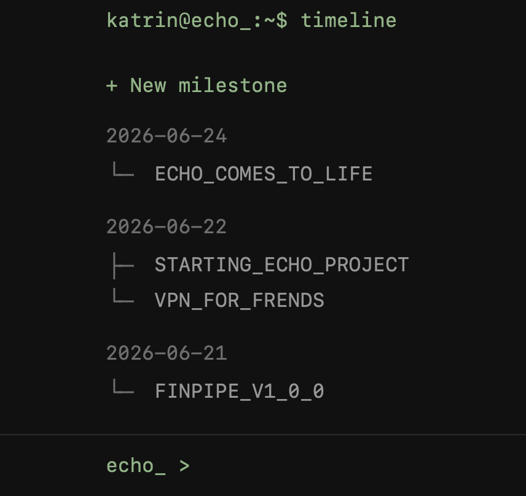
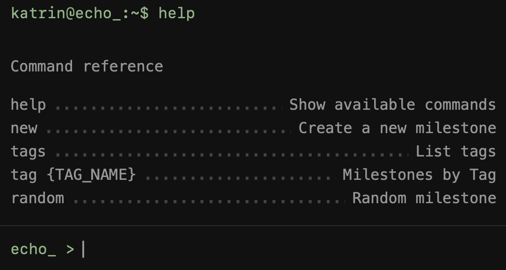

echo_  
running

  

-----
A small personal log of things worth remembering.   
Not a diary.  
Not a task tracker.  
Not a second brain.  
Just milestones.
---
### A quick look says more than a long explanation.

  

---
## Why

Most projects collect tasks.  
This one collects moments.  
A release.  
A move.  
A decision.  
A strange idea at 2 a.m.  
Something that would make it into a New Year's recap.

Everything is intentionally small, simple and fast.

---
## Terminal

Everything can be done from the terminal.

  

The terminal is a navigation layer, not a shell.
It opens existing pages and keeps navigation fast.
---
## Tech

- FastAPI
- Jinja2
- SQLAlchemy
- Pydantic
- SQLite
- Alembic
- Vanilla JavaScript

## Principles
No frontend build step.  
No SPA.  
No JavaScript framework.  
Keyboard-first interface.  
Minimal client-side JavaScript.

---
For setup, see [Development Guide](docs/development.md)
